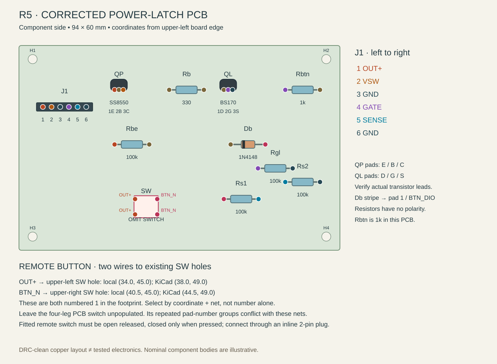
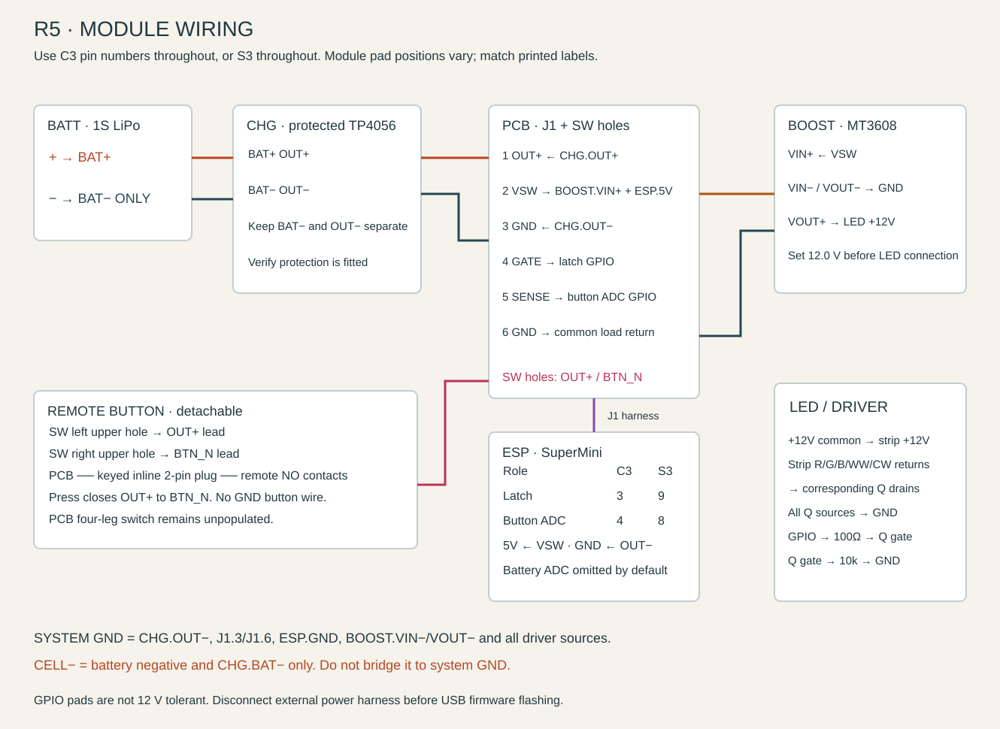
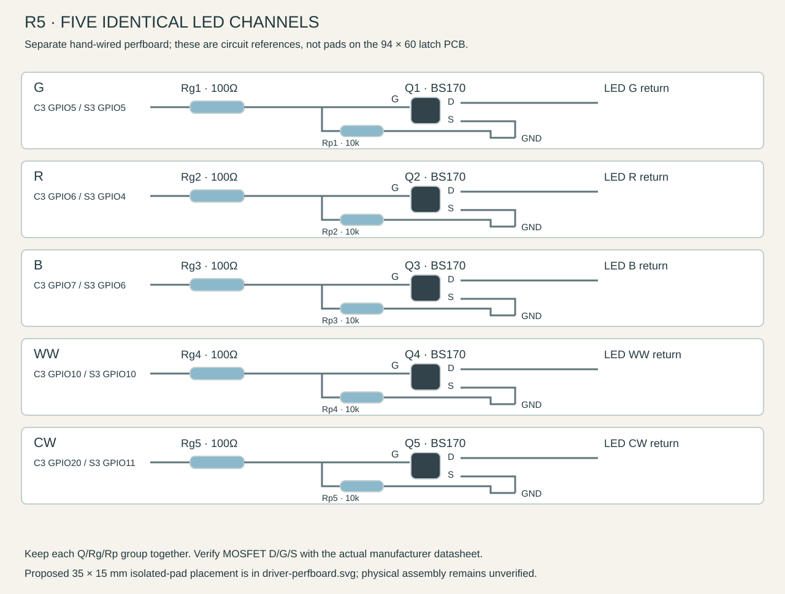
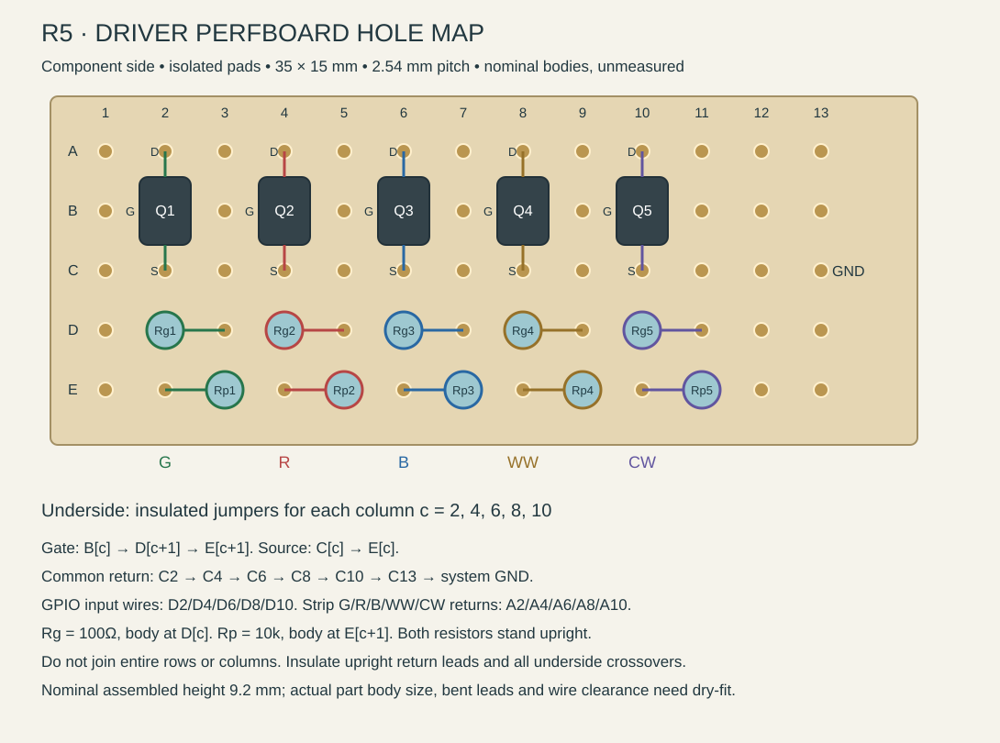

# Dark Moth R5 — electronics assembly

Build this guide around the **corrected 94 × 60 mm through-hole power-latch PCB**, an **ESP32-C3 SuperMini**, the separate five-channel LED driver, and **one remote button connected by a removable two-wire plug**. ESP32-S3 pin substitutions appear below. R5 changes the case and button arrangement; the copied board remains the earlier corrected copper design.

This is a source-checked assembly plan. It is **not a physically assembled or load-tested electronics release**. The checks below are necessary before enclosing a battery-powered prototype.

[PCB placement diagram](electronics/pcb-placement.svg) · [Module wiring](electronics/wiring.svg) · [LED driver wiring](electronics/led-driver.svg) · [Machine-readable manifest](electronics/assembly.json) · [Copied KiCad board](electronics/source/power_button_fixed.kicad_pcb)

## 1. Identify the board before soldering

Use [power_button_fixed.kicad_pcb](electronics/source/power_button_fixed.kicad_pcb), together with its [project settings](electronics/source/power_button_fixed.kicad_pro). It has four 2.7 mm mounting holes. The board outline is KiCad X = 4…98 mm, Y = 4…64 mm; nominal thickness is 1.6 mm.

The original `v3-button/hardware/power_button.kicad_pcb` is **not the board to build**: its GND track shorts to the Db cathode, its SENSE track shorts to an OUT+ switch pad, and another track violates clearance at Rgl. The corrected source reroutes these and adds the mounting holes. A new [KiCad DRC report](electronics/source/power_button_fixed-drc.rpt) checks the copied source. DRC does not test component internals or circuit operation.

**Leave the PCB switch footprint `SW` empty.** The footprint repeats pad number 1 across its upper row and pad number 2 across its lower row, but the generator assigns different nets to the two X columns. A switch matching those contact groups could permanently connect OUT+ to BTN_N. A remote switch with independently verified normally-open contacts avoids that conflict. Do not treat an installed four-leg PCB switch as interchangeable with the remote arrangement.

The older inventory and SMD-board documents refer to J4/J6 and an `EN_PWR` logic-enable rail. Those are a different design. This PCB uses **J1 and a real switched supply `VSW`**; it carries the boost converter and ESP supply current.

## 2. Gather the parts

Measure the resistor values with a meter. The inventory confirms the listed families are on hand but does not establish the manufacturer, exact pinout, connector model or load capability of each physical part.

| Location           | Reference          | Quantity | Part / value                                                    | Installation detail                                                      |
| ------------------ | ------------------ | -------: | --------------------------------------------------------------- | ------------------------------------------------------------------------ |
| Main PCB           | Rb                 |        1 | 330 Ω, ¼ W, 1%                                                  | No polarity; 10.16 mm lead pitch                                         |
| Main PCB           | Rbtn               |        1 | **1 kΩ**, ¼ W, 1%                                               | Follow the corrected PCB; the older wiring guide's 10 kΩ is inconsistent |
| Main PCB           | Rbe, Rgl, Rs1, Rs2 |        4 | 100 kΩ, ¼ W, 1%                                                 | No polarity; 10.16 mm lead pitch                                         |
| Main PCB           | Db                 |        1 | 1N4148 axial diode                                              | Stripe/cathode to pad 1, `BTN_DIO`                                       |
| Main PCB           | QP                 |        1 | SS8550 PNP, TO-92                                               | Pads 1/2/3 require **E/B/C** respectively                                |
| Main PCB           | QL                 |        1 | BS170 N-MOSFET, TO-92                                           | Pads 1/2/3 require **D/G/S** respectively                                |
| Main PCB           | J1                 |        1 | 1×6, 2.54 mm header plus mating six-way harness                 | Or insulated flying leads soldered to the same six holes                 |
| Main PCB           | SW                 |        0 | Existing SW_PUSH_6mm footprint                                  | **Unpopulated**; use two selected holes for remote leads                 |
| Remote button      | SW_REMOTE          |        1 | Normally-open 6×6 mm tactile switch                             | Nominal 4.3 mm overall height above its small board; verify your switch  |
| Remote button      | Daughterboard      |        1 | 12×12×1.6 mm insulating perfboard                               | Mechanical allowance; verify switch legs and case carrier before cutting |
| Remote button      | BUTTON_PLUG        |   1 pair | Matched keyed two-pin inline plug/socket with two-wire pigtails | Inline cable connector, not a new footprint on the main PCB              |
| LED driver         | Q1–Q5              |        5 | BS170 N-MOSFETs, TO-92                                          | Five separate channel switches                                           |
| LED driver         | Rg1–Rg5            |        5 | 100 Ω, ¼ W, 1%                                                  | Series gate resistors                                                    |
| LED driver         | Rp1–Rp5            |        5 | 10 kΩ, ¼ W, 1%                                                  | Gate-to-source pulldowns                                                 |
| LED driver         | DRV                |        1 | Insulated hand-wired perfboard                                  | Proposed 35×15 mm board; actual component packing is unverified          |
| Floor modules      | BATT               |        1 | 1S 3.7 V LiPo, 4.2 V maximum charge                             | Nominal 65×36 mm; 11 mm thickness allowance                              |
| Floor modules      | CHG                |        1 | USB-C TP4056 charger **with protection circuit**                | BAT+/BAT− and OUT+/OUT− must be identifiable                             |
| Floor modules      | BOOST              |        1 | MT3608 adjustable boost module                                  | Set output to 12.0 V before connecting the strip                         |
| Floor modules      | ESP                |        1 | **ESP32-C3 SuperMini**                                          | Primary; S3 SuperMini is the alternate, not an additional module         |
| Front light        | LED                |        1 | 100 mm of 12 V common-anode Yuji RGBWW strip                    | Match actual labels; do not assume the physical pad order                |
| Optional telemetry | Rd1, Rd2           |        0 | 100 kΩ each                                                     | Omitted in recommended build; firmware disables battery readings         |

Total installed discrete parts: **6 BS170s, 1 SS8550, 1 diode, 16 resistors and 1 remote switch**. Smallboard headers, wire, insulation, the button plug and case mounting hardware are additional. No capacitor is specified on the latch PCB; existing module capacitors remain part of their modules.

The R5 key stop allows **0.35 mm travel**: 0.10 mm initial gap plus 0.25 mm nominal switch movement. The [Omron B3F datasheet](https://components.omron.com/sites/default/files/datasheet_pdf/A070-E1.pdf) gives a nominal 0.25 mm pretravel for the 6×6×4.3 mm B3F-1000, with a 0.15–0.45 mm tolerance range. This is a dimensional reference, not proof of the unmarked switch on hand. Measure the actual switch stroke and adjust the stop/gap if necessary; the nominal geometry does not guarantee activation of every 6 mm tact.

No exact brand of button plug is established by the inventory. Choose and measure a matched keyed pair before fixing wire lengths; the CAD's 10×7×6 mm connector envelope is a routing allowance, not a verified part dimension. Do not substitute an unrelated connector solely because it has two contacts.

## 3. Populate the main PCB



Read the board from its component side, with J1 toward the upper-left. The following coordinates are **board-local millimetres from the upper-left edge**. Add 4 mm to X and Y to locate the same point in KiCad. `pad 1 → pad 2` gives the two lead holes, not the resistor-body centre.

| Ref  | Value  | Pad positions (X,Y)                   | Required net / polarity           |
| ---- | ------ | ------------------------------------- | --------------------------------- |
| Rb   | 330 Ω  | 1 (44,13) → 2 (54.16,13)              | PB → LDRV                         |
| Rbtn | 1 kΩ   | 1 (78,13) → 2 (88.16,13)              | GATE → BTN_DIO                    |
| Rbe  | 100 kΩ | 1 (28,29) → 2 (38.16,29)              | OUT+ → PB                         |
| Rgl  | 100 kΩ | 1 (70,36) → 2 (80.16,36)              | GATE → GND                        |
| Rs1  | 100 kΩ | 1 (60,45) → 2 (70.16,45)              | BTN_N → SENSE                     |
| Rs2  | 100 kΩ | 1 (78,40) → 2 (88.16,40)              | SENSE → GND                       |
| Db   | 1N4148 | 1 (62,29) → 2 (72.16,29)              | **K/stripe → BTN_DIO**, A → BTN_N |
| QP   | SS8550 | 1 (28,13), 2 (29.27,13), 3 (30.54,13) | **E→OUT+, B→PB, C→VSW**           |
| QL   | BS170  | 1 (60,13), 2 (61.27,13), 3 (62.54,13) | **D→LDRV, G→GATE, S→GND**         |

1. Install the six resistors and Db first. Bend leads to the specified holes, seat without forcing the bodies, solder and trim the underside.
2. Check Db's stripe against pad 1. Its orientation matters; the resistor orientation does not.
3. Identify the **actual manufacturer's transistor lead assignment** before installing QP and QL. The board requires the roles listed above. A generic “flat face toward you” rule is insufficient for unidentified parts. If lead order differs, use insulated formed leads or a verified adapter; do not let crossed bare leads touch.
4. Fit J1 and mark its pin-1 end. The footprint is rotated: its six holes run **horizontally left to right**, all at local Y=18 mm.
5. Fit the two remote-switch leads in Section 4. Leave the other SW holes and the switch body position empty.
6. Inspect both faces under magnification, then make the unpowered checks in Section 8.

The [onsemi SS8550 datasheet](https://www.onsemi.com/download/data-sheet/pdf/ss8550-d.pdf) identifies pins 1/2/3 as emitter/base/collector for its specified package. That supports this board's intended assignment, but does not identify a mixed-kit transistor by itself. Use the corresponding [onsemi BS170 datasheet](https://www.onsemi.com/download/data-sheet/pdf/mmbf170-d.pdf) for the purchased BS170 package. The inventory's assertion that every middle leg is always Gate is not a substitute for identifying a part.

### J1: the six actual PCB connections

| Pin | Local hole (X,Y) | PCB net | Wire to                                    |
| --: | ---------------- | ------- | ------------------------------------------ |
|   1 | (7,18)           | OUT+    | CHG.OUT+ protected positive supply         |
|   2 | (9.54,18)        | VSW     | BOOST.VIN+ **and** ESP.5V/VIN              |
|   3 | (12.08,18)       | GND     | CHG.OUT− system return                     |
|   4 | (14.62,18)       | GATE    | C3 GPIO3, or S3 GPIO9                      |
|   5 | (17.16,18)       | SENSE   | C3 GPIO4, or S3 GPIO8                      |
|   6 | (19.70,18)       | GND     | ESP.GND and the common load return harness |

Pins 3 and 6 are connected on the PCB. Use a sound return junction for the boost, ESP and driver; do not route LED load current through the thin remote-button cable.

## 4. Make the detachable remote button

The remote button closes **OUT+ to BTN_N**. It does not connect to GND, SENSE or GATE directly. The steering diode and sense divider are already on the main PCB.

| Lead  | Exact existing PCB hole                      | KiCad absolute | Remote end                                            |
| ----- | -------------------------------------------- | -------------- | ----------------------------------------------------- |
| OUT+  | SW upper-left hole at local **(34.0,45.0)**  | (38.0,49.0)    | Inline connector → one normally-open contact          |
| BTN_N | SW upper-right hole at local **(40.5,45.0)** | (44.5,49.0)    | Other connector contact → other normally-open contact |

**Both selected holes are numbered `1` in the footprint.** Coordinate, physical position and net identify them unambiguously. There is no `J2` or “button socket” footprint on this PCB.

1. On the loose four-leg tact switch, use continuity mode to find contacts that are **open when released and close only while pressed**. Do not choose two legs that are permanently common. Rotation and supplier drawings must be checked before soldering the small board.
2. Mount that switch on its 12×12 mm daughterboard. Keep solder joints low and insulate any protruding ends. Test its release clearance in the R5 carrier before final assembly.
3. Attach one wire from each selected contact to one half of a keyed two-pin connector. Attach the mating half to the two main-PCB holes above. Put the shrouded female contact half on the live PCB side when the chosen connector permits it.
4. Label the harness ends OUT+ and BTN_N, insulate every joint and add strain relief to both boards. The contact itself has no polarity, but consistent labels prevent later mistakes.
5. With the main PCB disconnected from power, verify the entire remote harness is open released and closed pressed. Unplugging it must leave the two PCB leads isolated.
6. Route it along the case edge with enough slack to remove the carrier and unplug it. Keep wire away from the moving key, lid screws, diffuser slide path and hot boost components. The model shows an intended route; final length depends on the actual connector and installed parts.

## 5. Wire charger, supply and boost



| From                 | To                         | Notes                                        |
| -------------------- | -------------------------- | -------------------------------------------- |
| BATT.+               | CHG.BAT+                   | Battery connection only                      |
| BATT.−               | **CHG.BAT− only**          | Do not connect this to system GND            |
| CHG.OUT+             | J1.1                       | Always-live protected supply                 |
| CHG.OUT−             | J1.3 and common system GND | Load return is on the protection output side |
| J1.2                 | BOOST.VIN+ and ESP.5V/VIN  | Switched battery rail; **not regulated 5 V** |
| BOOST.VIN− and VOUT− | System GND                 | Verify actual module labels                  |
| ESP.GND              | System GND / J1.6          | Common reference for all GPIOs               |
| BOOST.VOUT+          | LED.+12V                   | Set and measure 12.0 V first                 |

**Do not copy the old guide's common-ground list that joins BAT− and OUT−.** In the protected DW01/dual-MOSFET topology, the MOSFETs interrupt the negative cell path. Bridging battery negative to load return defeats that switching. See the manufacturer's [DW01A typical application circuit](https://www.ic-fortune.com/upload/Download/DW01A-DS-12_EN.pdf). Confirm your charger really has separate protected output pads; a basic TP4056 charger alone is not a protection circuit.

Measure the charger's programmed charge current and check it against the actual cell specification before charging. Do not infer cell capacity or allowable charge current from its outer dimensions. The TP4056 arrangement is not a documented load-sharing power supply; initial charging tests should be with the light off.

The ESP board's `5V` pin is the input of its onboard regulator. Supplying it from `VSW` is the inherited design, and may fail at a low cell voltage because of the PNP voltage drop plus regulator dropout. **Never connect the cell directly to 3V3.** Identify the clone's regulator and measure its 3.3 V rail during boot, BLE and LED load changes. Disconnect the external power harness before flashing the ESP through USB; “button off” does not establish reverse-power isolation.

## 6. Assemble the separate LED driver



These fifteen parts are on a separate hand-wired perfboard. They do **not** go into the 94×60 mm latch PCB. The source had no fabricated driver PCB. R5 supplies a proposed exact isolated-pad layout below and in [driver-layout.json](electronics/driver-layout.json); it requires lead forming and upright resistors. Dry-fit the actual parts before soldering.

| Channel    | MOSFET | Series resistor | Pulldown    | C3 GPIO | S3 GPIO | Strip return pad |
| ---------- | ------ | --------------- | ----------- | ------: | ------: | ---------------- |
| Green      | Q1     | Rg1 = 100 Ω     | Rp1 = 10 kΩ |   **5** |       5 | G                |
| Red        | Q2     | Rg2 = 100 Ω     | Rp2 = 10 kΩ |   **6** |       4 | R                |
| Blue       | Q3     | Rg3 = 100 Ω     | Rp3 = 10 kΩ |   **7** |       6 | B                |
| Warm white | Q4     | Rg4 = 100 Ω     | Rp4 = 10 kΩ |  **10** |      10 | WW               |
| Cool white | Q5     | Rg5 = 100 Ω     | Rp5 = 10 kΩ |  **20** |      11 | CW, sometimes W  |

For **each** row, make these four connections; `a` and `b` here are assigned resistor-lead names, not pre-existing PCB pad markings:

1. ESP GPIO → Rg.a. Rg.b → corresponding MOSFET **Gate**.
2. That same Gate → Rp.a. Rp.b → MOSFET **Source** → system GND.
3. MOSFET **Drain** → the specified strip channel return.
4. Strip common **+12V** → BOOST.VOUT+. Do not connect a channel return directly to GND or it will remain on.

Label the driver harness `G/R/B/WW/CW`, plus GND, before installing it. All five channels share GND but have separate gate and drain nodes. For a diode-mode MOSFET check, discharge the gate to source first so stored gate charge cannot confuse the result; identify the package from its datasheet before applying power.

Do not infer that a BS170 is fully enhanced at 3.3 V from its threshold-voltage number: the datasheet's on-resistance specification uses a higher gate-drive voltage. Check each channel's current, drain voltage and temperature at the intended brightness. The existing design does not establish a guaranteed full-white current or a thermally validated enclosed duty cycle.

### Proposed 35×15 mm perfboard hole layout



Use **isolated-pad** 2.54 mm perfboard, not connected stripboard. Trim to 35×15 mm only after confirming the actual parts fit. View the component side; rows **A…E** run top to bottom, columns **1…13** left to right. Hole A1 is 2.26 mm from the left edge and 2.42 mm from the top edge. All other holes follow the 2.54 mm pitch. No screw holes are reserved; the case bay retains the insulated board.

| Group      | D / G / S holes | 100 Ω Rg: body-side a / return b | 10 kΩ Rp: body-side a / return b | PWM wire | LED return wire |
| ---------- | --------------- | -------------------------------- | -------------------------------- | -------- | --------------- |
| Q1 / Green | A2 / B2 / C2    | D2 / D3                          | E3 / E2                          | D2       | A2              |
| Q2 / Red   | A4 / B4 / C4    | D4 / D5                          | E5 / E4                          | D4       | A4              |
| Q3 / Blue  | A6 / B6 / C6    | D6 / D7                          | E7 / E6                          | D6       | A6              |
| Q4 / WW    | A8 / B8 / C8    | D8 / D9                          | E9 / E8                          | D8       | A8              |
| Q5 / CW    | A10 / B10 / C10 | D10 / D11                        | E11 / E10                        | D10      | A10             |

For each group at column **c**, form the transistor leads into A[c], B[c], C[c] by their D/G/S role. Mount both resistors upright: Rg body over D[c], other lead at D[c+1]; Rp body over E[c+1], other lead at E[c]. Insulate the long return lead beside each resistor body. Nominal maximum height is 7.6 mm above the board for upright resistors including the lead loop, or 9.2 mm including board thickness; measure your completed part.

Solder insulated underside jumpers **B[c]→D[c+1]→E[c+1]** for that gate, and **C[c]→E[c]** for its source. Daisy-chain C2, C4, C6, C8 and C10 to C13, then wire C13 to system GND. Use insulated wire between separated pads so intermediate PWM pads cannot be bridged. Attach the five GPIO wires to D2/D4/D6/D8/D10 and the five strip-return wires to A2/A4/A6/A8/A10. A crowded C13 pad may use an insulated off-board ground splice instead of stacking five wires into one hole.

Verify continuity for every channel against [driver-layout.json](electronics/driver-layout.json), including isolation of each D-row PWM pad from GND and from its adjacent gate node through anything other than its 100 Ω resistor. This layout is source-derived and geometrically checked with nominal bodies; it has not been hand assembled.

## 7. Firmware required by this board

Download the [R5 firmware ZIP](electronics/dark-moth-r5-firmware.zip), containing the sketch and required `button_sense.h`, with `POWER_LATCH_DISCRETE=1`. C3 is the primary target. The latch GPIO drives HIGH to hold power and LOW to release; long-press power-off occurs after the button is released. For a cold start, hold the button until the ESP has booted and asserted the latch; an arbitrarily brief click is not guaranteed to power it on. The initial power-on press is not treated as a normal light-toggle gesture.

The fitted Rs1/Rs2 pair divides the 3.0–4.2 V button node to about **1.5–2.1 V**. This is not a guaranteed digital HIGH: the [ESP32-C3 datasheet](https://documentation.espressif.com/ESP32-C3_Datasheet_en.pdf) gives a minimum guaranteed HIGH input of 0.75×VDD. At VDD=3.3 V that is 2.475 V. R5 therefore reads the ADC with **1000 mV press / 500 mV release hysteresis**, averages four conversions, and retains the existing 30 ms debounce. ADC attenuation is configured before boot confirmation or normal button reads. The module-style active-low switch path keeps its digital read.

The source defaults `BATTERY_SENSE_ENABLED=0`. Leave Rd1/Rd2 and GPIO1 unconnected. The battery BLE characteristic remains present with an empty value; no fictitious percentage is published. A fresh mobile app session displays the reading as unavailable. The current app ignores empty payloads rather than clearing earlier values, so restart the app after switching from telemetry-enabled firmware to avoid retaining an old reading. A raw-cell divider could feed current into an unpowered ESP input. Add telemetry only after designing and verifying its isolation and calibration; changing the input to VSW would measure the switched rail, not exact cell voltage.

Flash with the external supply harness disconnected. After extracting the firmware ZIP, run these commands from the directory containing `dark_moth_ble_v3/`. They compile; add the selected serial port for a separate upload:

```bash
arduino-cli compile --fqbn esp32:esp32:esp32c3:CDCOnBoot=cdc dark_moth_ble_v3
arduino-cli compile --fqbn esp32:esp32:esp32s3:USBMode=hwcdc,CDCOnBoot=cdc dark_moth_ble_v3
```

Only one board pin map is used in a build. Do not combine C3 GPIO3/4 button connections with the S3 LED map.

## 8. Bring up in stages before fitting the battery

1. **Unpowered:** inspect transistor leads and diode stripe. Verify each J1 pin reaches its named component pads using [pcb-pads.json](electronics/pcb-pads.json). Verify no hard shorts between OUT+, VSW and GND. A transistor/diode circuit is not expected to show infinite resistance in every probe direction; compare with its net topology.
2. **Remote switch:** independently check open released / closed pressed, then verify the same behavior through the plug. Confirm no bridge remains where the original PCB SW body would sit.
3. **Module preparation:** power the boost separately from a current-limited bench supply and set 12.0 V unloaded. Keep it disconnected from the LED until measured. Configure the actual charger's charge current to suit the cell.
4. **Latch only:** with battery disconnected, feed a current-limited 3.0–4.2 V bench source to J1.1 and J1.3. Use an initial modest current limit appropriate to the disconnected load. Check OUT+, VSW, QP base and QL gate while pressing the remote button. A press should raise VSW; with no MCU holding the gate, release should remove that drive.
5. **ESP only:** attach its VSW/GND/latch/sense wires, leaving the boost and LEDs disconnected. Check actual 3.3 V rail stability, ADC readings at rest/press, boot-and-release latching, short tap and long-hold-release shutdown. Measure the latch GPIO during cold start and at full cell voltage: the OUT+ button path feeds that GPIO through Db/Rbtn before the ESP is fully powered. The 1 kΩ resistor limits current but is not isolation or a level shifter; verify the actual GPIO voltage/current against the ESP limits before approving this inherited circuit. Raise supply current limit only as necessary for known ESP boot demand; record peak current rather than assuming it.
6. **One LED channel:** attach the boost, then test one channel at low brightness. Verify color, true off and MOSFET orientation. Repeat for all five. Check the strip's measured +12 V rather than its pad location.
7. **Intended load:** increase brightness gradually while recording input current, VSW drop, regulator rail, QP temperature, driver temperatures and boost temperature. The SS8550 datasheet's high-current saturation test uses substantially more base current than the board's 330 Ω resistor supplies; maximum transistor current is not a promise of low loss here. Reject resets, unstable latching or excessive heating before enclosure assembly.
8. **Power-off and charging:** measure off current with the button released, verify safe charger behavior with the chosen cell, and confirm the battery protection return has not been bypassed. No measured standby-current or thermal limit has yet been established by this project.
9. **Mechanical dry fit:** use an insulating barrier under the main PCB, clear all trimmed leads from the cell, secure modules without pressing on the pouch, and check that the remote-button harness disconnects and the diffuser slides out freely. Close the case only after those checks pass.

## Source provenance and reproducibility

The copied PCB/project bytes come from the original workspace's `v3-button/case/pcb/`, not from the flawed `v3-button/hardware/` variant. The manifest records the PCB SHA-256. Pad coordinates are extracted from that copied source by [extract_board.py](electronics/extract_board.py). Board reference designators and nets are exact; commodity-module and component body dimensions remain nominal.

[draw_guides.py](electronics/draw_guides.py) redraws the circuit SVGs; [draw_perfboard.py](electronics/draw_perfboard.py) draws the proposed perfboard from the manifest. [modules.json](electronics/modules.json) records the external BOM and uncertainty; [interconnects.json](electronics/interconnects.json) records the two ESP pin maps and point-to-point topology. A 3D rendering communicates assembly intent; it does not establish lead clearance, connector fit, electrical operation or a fabricated perfboard layout.
