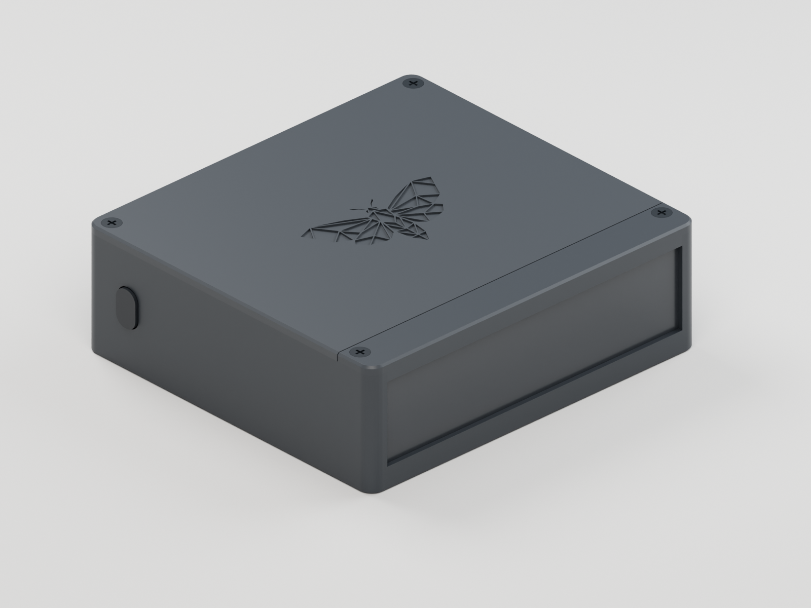

# Dark Moth — enclosure R5

A printable redesign for the **v3-button 12 V hand-build**: the original faceted moth on a clean lid, a **left-side button**, and smoked acrylic that slides out after removing its separate front rail. The electronics lid stays closed during diffuser replacement.

The case is **111 × 103 × 36 mm**, with the side key projecting another **0.8 mm**. Interior: **106.2 × 98.2 × 31.2 mm**. This is a digitally checked prototype ready for a first print; purchased-part fit, switch operation, light output and temperature still require a bench build.



[Complete R5 print and assembly pack](dark-moth-r5-print-pack.zip) · [Print setup guide](print.html) · [One-board electronics guide](CARRIER_GUIDE.md) · [Verification](VERIFICATION.md) · [Design review](REVIEW.md)

**Build on one board:** open the [18 × 24 carrier in 3D](perfboard.html?board=carrier#workbench), [written instructions](CARRIER_GUIDE.md) and [electrical qualification review](PERFBOARD_REVIEW.md). The carrier has **18 columns and rows A–X**. It holds the ESP controller, charger and boost modules alongside the latch and five-channel LED driver. Battery, LED strip and remote button connect by cables. The earlier 94 × 60 mm latch PCB is not required. Actual module pin positions, module retention, case mounting and powered operation require verification.

The existing case meshes, full-assembly model and mechanical instructions below retain the **earlier R5 arrangement**. They do not establish the integrated carrier's mounting or USB alignment. [Earlier latch/driver layouts](PERFBOARD_GUIDE.md) remain available as references; [digital verification](PERFBOARD_VERIFICATION.md) states what has been checked.

## Start with the coupon

Print [coupon.stl](prints/coupon.stl) using the same black PETG, plate and profile intended for the lid. The updated coupon puts the original 44 mm moth deboss **against the bed**, matching the lid. The **3.2 / 3.4 / 3.6 mm** open-top diffuser slots face upward, left to right when viewed from above with the slot banks nearest you. Test a deburred corner or offcut of the actual acrylic; each slot is 12 mm wide.

The default sheet is **104 × 28 × 3 mm**. The remembered [earlier dark-sheet case](https://github.com/jedashford/lights/blob/main/hardware/case_v2/case.scad) accepted an approximately **94.8 × 77.4 × 3 mm** sheet. That pre-cut sheet is **too narrow** for this 100 mm light window. The actual stock remains unmeasured; confirm it before cutting.

## Print files and settings

For Bambu Studio, the [body support project](profiles/body-p1s-petg.3mf) and [button support project](profiles/button-p1s-petg.3mf) save the tested settings. Open as projects. They target **P1S / 0.4 mm / Generic PETG / Textured PEI**; select your actual machine and material, recheck supports and re-slice. Follow the [print setup guide](print.html). These unsliced projects are separate from the portable geometry-only plates below.

All STL units are millimetres and print orientation is already applied. [black-parts.3mf](prints/black-parts.3mf) contains six separate objects on a portable plate. It contains no printer profile, filament settings or G-code.

| File                                            | Material / bed orientation                                          |   Quantity |
| ----------------------------------------------- | ------------------------------------------------------------------- | ---------: |
| [body.stl](prints/body.stl)                     | Black PETG; floor down, cavity up                                   |          1 |
| [lid.stl](prints/lid.stl)                       | Black PETG; outside face down                                       |          1 |
| [rail.stl](prints/rail.stl)                     | Black PETG; outside face down                                       |          1 |
| [button.stl](prints/button.stl)                 | Black PETG; visible side-key face down                              |          1 |
| [switch_carrier.stl](prints/switch_carrier.stl) | PETG; flat carrier back down, retaining lips up                     |          1 |
| [coupon.stl](prints/coupon.stl)                 | Moth down, slot banks up; same profile as lid                       |    1 first |
| [diffuser.stl](prints/diffuser.stl)             | Acrylic cutting/fit template; optional translucent-print experiment | 1 template |

[diffuser-template.3mf](prints/diffuser-template.3mf) provides the **104 × 28 × 3 mm** cutting envelope separately. The intended diffuser is purchased smoked acrylic. Printing that shape in opaque black PETG blocks the light.

Starting profile: **0.4 mm nozzle, 0.2 mm layers, four walls, six top/bottom layers, 20% gyroid**. Use the filament manufacturer's temperature settings. **Enable normal automatic supports everywhere for the body and button, including bridges.** Build-plate-only supports are insufficient. Check actual support paths in Preview; enabling supports can suppress the warning even when none are generated. The button’s small flange also needs support underneath and a physical release check. See the [per-part print setup](print.html), [all-seven-part review](PRINTABILITY.md) and [slicing evidence](VERIFICATION.md).

## Replace the diffuser

The sheet sits in a **104.4 mm wide × 3.4 mm thick** channel behind a **100 × 24 mm** opening. Nominal side engagement is 2 mm. A bottom stop and removable top keeper retain it, with 0.25 mm vertical play.

Power off. Remove the two front screws, lift the rail, and lift the sheet straight up. Slide the replacement to its bottom stop and reinstall the rail. The two rear lid screws stay fitted. No tape or glue retains the diffuser.

For other stock thicknesses, change `sheet_t` within **1–3.2 mm**, and review `slot_clear` in [dimensions.scad](cad/dimensions.scad). Rebuild the body, rail, template and coupon together, then rerun verification. Supplied print files target **3 mm** stock. Width and height changes require a new fit review.

## Earlier R5 hardware and assembly order

This earlier case reference uses the corrected **94 × 60 mm through-hole power-latch PCB**, primary **ESP32-C3 SuperMini**, protected TP4056 charger, MT3608 boost, LiPo and separate five-channel perfboard driver. Its BOM, solder holes and mounting sequence are in [PCB_GUIDE.md](PCB_GUIDE.md). For the integrated carrier, use [CARRIER_GUIDE.md](CARRIER_GUIDE.md); the four PCB posts and floor-module bays below are not its mounting instructions. The older 24 V production controller is another design.

**Leave the main PCB `SW` footprint unpopulated.** Its repeated pad numbers and assigned nets conflict with a matching four-leg switch's contact grouping. The R5 remote switch replaces it. Use the two specifically identified OUT+ and BTN_N holes in the guide; do not identify them by pad number alone.

Additional mechanical items:

- **4 × M2.5 × 10 mm** self-tapping case screws; head diameter at most 5.2 mm and height at most 1.3 mm. Recesses are Ø5.3 mm plastic pilots, not insert sockets.
- **4 × M2.5 × 8 mm** PCB screws through the four existing board holes.
- **2 × M2 × 8 mm** side-carrier screws, inserted from inside into Ø1.7 mm plastic pilots.
- One normally-open **6 × 6 × 4.3 mm** tact switch on a **12 × 12 × 1.6 mm** daughterboard.
- A matched keyed two-pin plug/socket pair, flexible wire, insulation and removable module-retention material. Measure the actual connector and screw heads.

1. Print the coupon, then the enclosure parts. Deburr the grooves, screw bores and key opening. Test screw grip without splitting or stripping plastic.
2. **Install the side button before the boost module.** Feed the key through the left wall from inside; its larger flange captures it. Slide the daughterboard into the carrier's edge lips, with the switch facing outward. Seat the carrier in the body cradle and tighten its two interior screws. The lower screw's approach is obstructed once the boost is installed. The daughterboard is mechanically captured; it does not rely on tape.
3. Check key press and release. Centre is **Y=85, Z=15.5 mm** on the left wall; press direction is **+X**. The nominal tip gap is **0.10 mm**, hard-stop travel **0.35 mm**, and resulting switch depression **0.25 mm**. Actual tact switches vary. Confirm contacts close before the stop and open fully on release; adjust the gap/stop for the measured switch instead of forcing preload.
4. Fit the battery and floor modules in their bays, insulating solder joints and securing each against movement. Keep the pouch free of pressure and sharp leads. The proposed driver board uses 0.8 mm underneath for insulated jumpers and a thin insulating sheet; verify its finished 10 mm overall allowance physically.
5. Install the **100 × 12 mm** strip on the front rib, emitting toward the window. Its nominal emitting face is Y=11.2 mm, **9.2 mm** behind the acrylic's rear face. Confirm the adhesive and thermal arrangement under actual load. Keep strip wires out of the diffuser path.
6. Mount the corrected main PCB on the four posts. Its hole centres are **(4,4), (90,4), (4,56), (90,56) mm** from the board-local corner. The 3D model preserves the KiCad board's handedness: case **X=6.1+local X**, **Y=76−local Y**; the component face points up. Check trimmed leads and insulation beneath it.
7. Connect the remote button through its removable two-pin harness and follow the electrical guide's staged checks. **Battery negative goes only to charger BAT−; system return uses protected OUT−.** The model's wire routes are illustrative; determine service slack using the actual dry assembly.
8. After electrical and mechanical checks, fit the lid with its two rear screws, insert the acrylic, and fasten the front rail. Check both right-side USB openings, button release and diffuser removal again.

The front USB port is charging; the rear is programming. Disconnect the external supply harness before flashing through USB. R5 firmware includes ADC button sensing for the fitted divider and disables unprotected raw-battery telemetry; download the [firmware ZIP](electronics/dark-moth-r5-firmware.zip) and follow [its guide](PCB_GUIDE.md#7-firmware-required-by-this-board).

## Earlier full 3D assembly and confidence

The [full assembly GLB](preview/full-assembly.glb) and [part catalog](preview/assembly-parts.json) contain **108 logical groups**, including six enclosure parts, the actual KiCad PCB and reference components, nominal modules and their major packages, fifteen discrete driver components, remote switch/daughterboard, connector halves, ten individual screws and 29 logical wire groups. The unsupported PCB switch is hidden by default and marked **do not populate**.

This covers the **earlier R5 build BOM**, not the integrated carrier's arrangement. Supplier-specific inventories and exact positions of every small SMD on commodity modules are not available. Those module packages, fasteners and wire routes are labeled nominal. Exploded wires retain their assembled route; the view does not simulate wire stretch or a collision-free disassembly sequence.

| Item               | Nominal envelope / location             | Evidence                                                                         |
| ------------------ | --------------------------------------- | -------------------------------------------------------------------------------- |
| Main PCB           | 94 × 60 × 1.6 mm; (6.1,16,16)           | Corrected KiCad outline, pads, copper and library component geometry             |
| LiPo               | 65 × 36 × 11 mm; (11,32,0)              | Retained allowance; actual cell unmeasured                                       |
| Boost              | 36 × 17 × 14 mm; (16,79,0)              | Retained module allowance; clone variants differ                                 |
| Driver             | 35 × 15 mm board; (54.5,80,0.8)         | Proposed exact isolated-pad layout; assembled parts unmeasured                   |
| Charger            | 25 × 16.5 × 6 mm; (81.2,25.75,0)        | Retained module allowance                                                        |
| ESP32-C3           | 22.5 × 18 mm PCB; (83.7,47,0)           | Nominal module inside the retained 27 × 18 × 12 mm bay                           |
| Side daughterboard | 12 × 12 × 1.6 mm; vertical at X=8.1…9.7 | New carrier geometry; purchased switch unmeasured                                |
| Acrylic            | 104 × 28 × 3 mm; Y=−1, bottom Z=3.2     | New design allowance; user's stock unconfirmed                                   |
| Moth               | 44 mm wide, 0.5 mm deboss               | Original 44 paths from [official artwork](https://github.com/jedashford/lights/blob/main/branding/assets/logo_vector.svg) |

The smoked material shown in renders is unlit and illustrative. Transmission, colour shift, visible hotspots, output, battery charging behaviour and temperatures remain unmeasured. Digital mesh clearance and slicer success do not establish physical fit or safe enclosed operating power.

## Local website

Run `python3 site/serve.py --port 8000`, then open [localhost:8000](http://localhost:8000/). The site includes six real-geometry renders and interactive assembly, exploded, board, diffuser-service and translucent inspection modes, part selection/visibility and camera controls. Assets are local. Pass `--legacy-site /path/to/v3-button/site` to retain the old guide at `/legacy/`. The previous R4 ZIP URL redirects to the current R5 pack.

## Reproduce

Open [cad/enclosure.scad](cad/enclosure.scad) in OpenSCAD. Parts: `body`, `lid`, `rail`, `button`, `switch_carrier`, `diffuser`, `coupon`. `assembly=true` preserves assembly coordinates; otherwise exports use print orientation.

Install OpenSCAD, Blender, Bambu Studio and KiCad separately; the Python requirements do not provide them. The commands below use the macOS application paths from the reference build. Run from the repository's `v3-button/enclosure/` directory or the extracted `dark-moth-r5/` folder. KiCad validation must use its bundled Python because it supplies `pcbnew`.

```sh
python3 -m venv .venv
.venv/bin/pip install -r tools/requirements.txt
.venv/bin/python tools/build.py
.venv/bin/python tests/verify.py
.venv/bin/python tests/verify_variants.py
.venv/bin/python tests/test_printability.py
.venv/bin/python tools/slice_check.py
.venv/bin/python tools/build_print_project.py
/Applications/KiCad/KiCad.app/Contents/Frameworks/Python.framework/Versions/Current/bin/python3 electronics/validate.py
.venv/bin/python tools/build_guide.py
/Applications/Blender.app/Contents/MacOS/Blender --background --python tools/render.py
.venv/bin/python tests/test_full_assembly.py
.venv/bin/python tests/audit_full_assembly.py
.venv/bin/python tools/package.py
.venv/bin/python -m unittest discover -s tests -p 'test_*.py'
node --test tests/test_assembly_state.mjs
.venv/bin/ruff check tools tests site electronics
.venv/bin/ruff format --check tools tests site electronics
npx --yes prettier@3.6.2 --check '*.md' index.html 'site/*.css' 'site/*.js'
```

The downloaded pack also expands the verified firmware under `firmware/dark_moth_ble_v3/`. From its root, run the native button-sense regression test with:

```sh
clang++ -std=c++11 -Wall -Wextra -Werror -Ifirmware/dark_moth_ble_v3 tests/test_button_sense.cpp -o /tmp/dark-moth-button-sense-test
/tmp/dark-moth-button-sense-test
```

In the repository enclosure directory, use `-I../firmware/dark_moth_ble_v3` instead. Firmware compilation and flashing instructions are in [PCB_GUIDE.md](PCB_GUIDE.md#7-firmware-required-by-this-board).

The R5 pack includes electronics source/manifests, diagrams, firmware ZIP, print files, full models, six renders, documentation and local-site tools. Generated G-code, caches and temporary KiCad preferences are excluded. [Print hashes](prints/manifest.json) and [verification evidence](verification-summary.json) identify the delivered artifacts; packaging refuses stale verification and model inputs.
